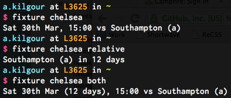

next-fixture
==========
next-fixture prints out the details of the next fixture for your chosen football team, from the following leagues:
Premier League, Scottish Premier League, Championship, League One, League Two, Conference, Scottish First Division, Scottish Second Division, Scottish Third Division

The idea was taken (read: stolen) from [dotcode's eat.st script](https://github.com/dotcode/eat-street). Cheers Jude :-)

	
How it works
------------
It's a Python script that simply grabs all possible teams from the [BBC Sport Teams Page](http://www.bbc.co.uk/sport/football/teams) using urllib2, uses BeautifulSoup to scrape the relevant list of teams, and spits back their names.
It then uses the name of the team to grab the [Fixtures Page](http://www.bbc.co.uk/sport/football/teams/chelsea/fixtures) and uses urllib2 and BeautifulSoup to scrape the page and get the next fixture information.

How does it look
----------------
Like this:

	
Simple, huh?

Requirements
------------
Python, and it's reliant upon [BeautifulSoup](http://www.crummy.com/software/BeautifulSoup/) to parse the HTML … if you see the following error:

	ImportError: No module named BeautifulSoup

… then try installing BeautifulSoup:

	$ easy_install BeautifulSoup

(That's obviously the thing to do for the other modules as well, should they be missing)

Should you wish to display the information on your desktop, like me, then (on OS X) you'll be wanting to grab the fantastic [GeekTool](http://projects.tynsoe.org/en/geektool/).
	
	
Installation
------------
	$ mkdir -p ~/bin
	$ curl -skL https://raw.github.com/howlingmad/next-fixture/master/fixture >~/bin/fixture
	$ chmod +x ~/bin/fixture
	
Make sure `~/bin` is in your `$PATH` - or put the `fixture` script somewhere else on your `$PATH`.
	
	
Usage
-----
	$ fixture list
	
This will generate a list of all the supported teams and their numbers

	$ fixture chelsea
	
This will print out the next fixture for Chelsea

	$ fixture 5
	
This will print out the next fixture for the team numbered 5 in the list

	$ fixture chelsea relative
	$ fixture 5 relative

Adding the option 'relative' will tell you how many days until the match

	$ fixture chelsea both
	$ fixture 5 both
	
Adding the option 'both' will show both the date and how many days until the match
	
I trigger the command using [GeekTool](http://projects.tynsoe.org/en/geektool/) so that I have the info displaying on my desktop.
	
	
Author
------
Alex Kilgour : [http://kil.gr](http://kil.gr)

License
-------
next-fixture is licensed under the [WTFPL license.](http://sam.zoy.org/wtfpl/)
